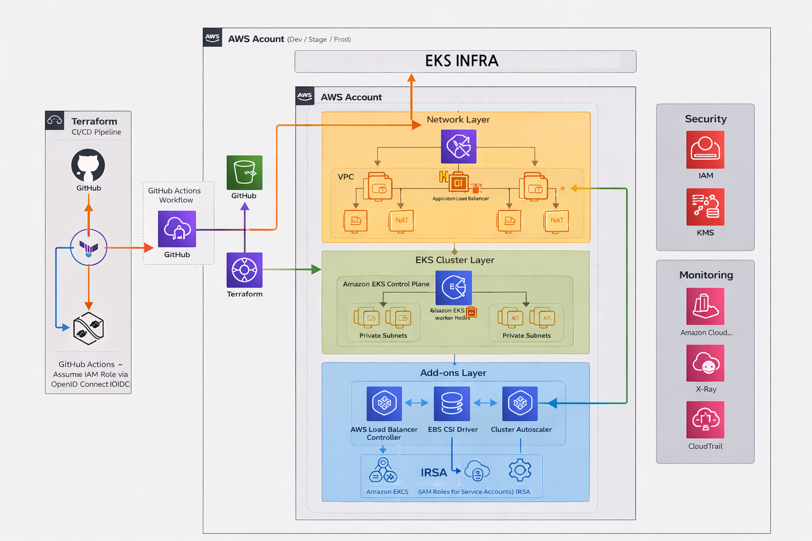

# EKS Infrastructure (Terraform)

Production-Ready Amazon EKS 클러스터를 Terraform으로 구축하고 관리하는 Infrastructure as Code 프로젝트.

## 주요 특징

- **레이어 기반 아키텍처**: Network → EKS → Platform → Workloads 4단계 분리로 Blast Radius 최소화
- **IRSA (IAM Roles for Service Accounts)**: Pod 레벨 최소 권한 원칙 적용
- **Partial Backend Configuration**: 환경별 State 분리 및 CI/CD 파이프라인 호환
- **멀티 환경 지원**: dev/prod 환경 독립 운영



### 레이어 구조

```
Layer 1: Network        Layer 2: EKS           Layer 3: Platform       Layer 4: Workloads
┌──────────────┐       ┌──────────────┐       ┌──────────────┐        ┌──────────────┐
│ VPC          │       │ EKS Cluster  │       │ ALB Controller│       │ Applications │
│ Subnets      │──────▶│ Node Groups  │──────▶│ EBS CSI      │───────▶│ Ingress      │
│ NAT Gateway  │       │ OIDC Provider│       │ External DNS │        │ HPA          │
│ Route Tables │       │ Bastion Host │       │ Autoscaler   │        │              │
└──────────────┘       └──────────────┘       └──────────────┘        └──────────────┘
     ▲                       ▲                      ▲                       ▲
     │                       │                      │                       │
  network.              eks.tfbackend          platform.              app-tier.
  tfbackend                                    tfbackend               tfbackend
```

## 디렉토리 구조

```
.
├── environments/                    # 환경별 Root Modules
│   ├── dev/
│   │   ├── config/                  # Partial Backend Configuration
│   │   │   ├── network.tfbackend
│   │   │   ├── eks.tfbackend
│   │   │   ├── platform.tfbackend
│   │   │   └── app-tier.tfbackend
│   │   ├── 01-network/              # Layer 1: VPC, Subnets
│   │   ├── 02-eks/                  # Layer 2: EKS Cluster, Node Groups
│   │   ├── 03-platform/             # Layer 3: Addons (IRSA 기반)
│   │   └── 04-workloads/
│   │       └── app-tier/            # Layer 4: Applications
│   └── prod/                        # Production (동일 구조)
│
├── modules/                         # 재사용 가능한 Terraform Modules
│   ├── networking/
│   │   ├── vpc/                     # VPC, Subnets, NAT, IGW
│   │   └── security-groups/
│   ├── compute/
│   │   └── bastion/                 # Bastion Host
│   ├── eks/
│   │   ├── cluster/                 # EKS Control Plane + OIDC
│   │   ├── node-group/              # Managed Node Groups
│   │   └── fargate-profile/         # Fargate Profile (선택)
│   ├── addons/
│   │   ├── aws-load-balancer-controller/
│   │   ├── ebs-csi-driver/
│   │   ├── external-dns/
│   │   ├── cluster-autoscaler/
│   │   ├── metrics-server/
│   │   └── container-insights/
│   ├── iam/
│   │   ├── irsa/                    # IRSA 공통 패턴
│   │   └── user-roles/
│   ├── kubernetes/
│   │   ├── app/                     # Deployment + Service
│   │   └── ingress/
│   │       └── alb-ssl/             # ALB Ingress + ACM
│   └── security/
│       └── acm/                     # ACM Certificate
│
├── scripts/
│   ├── deploy.sh                    # 전체 배포 스크립트
│   ├── destroy.sh                   # 전체 삭제 스크립트
│   └── backup-state.sh
│
├── terraform/
│   └── iam-github-oidc/             # GitHub Actions OIDC 설정
│
├── docs/
│   ├── architecture.md              # 상세 아키텍처 문서
│   └── runbook.md                   # 운영 매뉴얼
│
└── .github/
    └── workflows/
        ├── terraform-plan.yml       # PR 시 Plan
        └── terraform-apply.yml      # main 병합 시 Apply
```

## 빠른 시작

### 사전 요구사항

- Terraform >= 1.5.0
- AWS CLI (configured)
- kubectl
- Helm 3.x

### 배포

```bash
# 전체 배포 (01-network → 02-eks → 03-platform → 04-workloads)
./scripts/deploy.sh dev

# 특정 레이어만 배포
./scripts/deploy.sh dev -l 02-eks

# Dry-run (명령어만 출력)
./scripts/deploy.sh dev -d
```

### 삭제

```bash
# 전체 삭제 (역순: 04 → 03 → 02 → 01)
./scripts/destroy.sh dev

# 특정 레이어만 삭제
./scripts/destroy.sh dev -l 03-platform
```

## 문서

- [Architecture](./docs/architecture.md) - 상세 아키텍처 및 설계 결정
- [Runbook](./docs/runbook.md) - 운영 절차 및 트러블슈팅

## 기술 스택

| Component     | Version   | Description        |
| ------------- | --------- | ------------------ |
| Terraform     | >= 1.5.0  | IaC                |
| EKS           | 1.31      | Kubernetes         |
| AWS Provider  | ~> 5.7.0  | Terraform Provider |
| Helm Provider | ~> 2.10.0 | Helm Charts 관리   |


