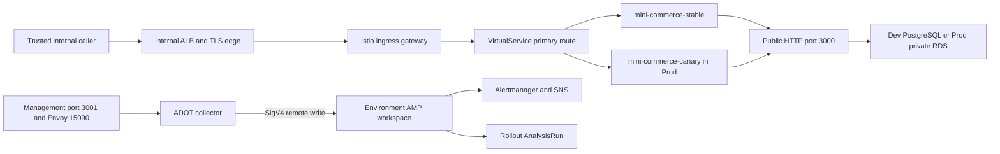
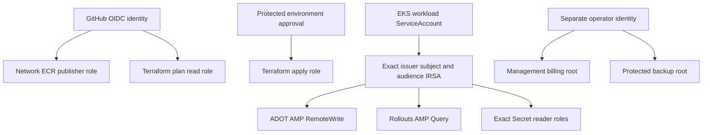

# Mini Commerce 플랫폼 아키텍처와 코드 지도

이 저장소는 AWS 기반 플랫폼의 인프라·controller·권한을 관리합니다. `argocd-gitops`는 Kubernetes desired state, `mini-commerce`는 애플리케이션·DB schema·이미지 발행을 관리합니다.
설계의 목표는 배포 속도와 운영 책임을 함께 유지하는 것입니다. 아래 다이어그램은 코드가 구현하는 구성이며, 실제 계정에 배포·복구·알림이 성공했다는 증거는 별도로 확보해야 합니다.

목차: [저장소 경계](#저장소-경계) · [배포와 데이터 흐름](#배포와-데이터-흐름) · [폴더와 코드 지도](#폴더와-코드-지도) · [계정과 권한](#계정과-권한) · [규모별 운영 선택](#규모별-운영-선택) · [검증과 발표](#검증과-발표)

## 저장소 경계

핵심 요약: 하나의 리소스에는 하나의 desired-state writer를 둡니다. Terraform state를 Kubernetes 애플리케이션 배포 이력과 분리해 변경·복구 범위를 제한합니다.
GitOps는 Git에 기록된 목표 상태를 controller가 지속해서 실제 클러스터에 맞추는 운영 방식입니다.

| 저장소 | 소유하는 코드 | 주요 변경 단위 |
| --- | --- | --- |
| EKS-infra | AWS/Terraform, 기반 controller, IRSA, state/plan/복구 도구 | root별 검토한 saved plan |
| argocd-gitops | AppProject/ApplicationSet, Helm values, Istio·정책·Rollout | 환경별 Git commit과 image digest |
| mini-commerce | Node.js 서비스, PostgreSQL migration, 부하·API·공급망 검증 | 소스 SHA와 immutable OCI image index |

Controller의 설치와 controller가 관리하는 객체는 구분합니다. 예를 들어 EKS-infra가 Argo Rollouts를 설치하고, GitOps가 `Rollout`·`AnalysisTemplate`·`VirtualService`를 선언합니다.
External Secrets의 기존 Argo → Terraform 소유권 이전에는 UID·no-op plan을 확인하는 단계가 있습니다. 이 전환용 guard를 단순한 파일 정리 대상으로 취급하지 않습니다.

## 배포와 데이터 흐름

핵심 요약: 이미지 빌드와 환경 승격을 분리합니다. Dev에서 검증한 immutable index digest를 Prod에 전달하고, 승인·배포·관측 결과를 같은 source identity에 결속합니다.
OCI image index는 amd64/arm64 등 여러 platform 이미지 digest를 묶은 immutable manifest입니다.

```mermaid
flowchart LR
  App[mini-commerce source] --> CI[GitHub Actions test and build]
  CI -->|OIDC scoped role| ECR[Network account ECR]
  ECR --> Proof[Image index and attestations]
  Proof --> DevGit[GitOps Dev values PR]
  DevGit --> Dev[Dev Argo CD Deployment]
  Dev --> Observe[Deployment and SLO evidence]
  Observe --> Approval[Prod promotion review]
  Approval --> ProdGit[GitOps Prod values PR]
  ProdGit --> Prod[Prod Argo CD Rollout]
  Prod --> Analysis[Istio weights and AMP AnalysisRun]
```

이 그림에서 봐야 할 핵심: Prod용 이미지를 다시 빌드하지 않습니다. 소스 SHA·workflow run·image index·GitOps revision·cluster identity를 함께 추적합니다. PR 생성은 원하는 배포 상태를 제안하는 단계이며, 그 자체가 runtime 성공은 아닙니다.

실제 ingress와 namespace 정책은 GitOps의 `platform/istio/`, 애플리케이션 라우팅은 `charts/mini-commerce/templates/istio-routing.yaml`에서 정의합니다. AWS LBC는 AWS load balancer/target group을 조정하고, Istio의 명명된 `primary` route는 stable/canary 서비스로 트래픽을 전달합니다. Prod Rollouts가 이 route의 가중치를 변경합니다.

이 그림에서 봐야 할 핵심: business 트래픽과 management/metrics 트래픽은 포트·네트워크 정책·권한이 다릅니다. `3001`을 public Service나 ALB에 연결하지 않습니다. edge의 실제 target group·certificate·DNS·보안 정책 입력은 활성화 전에 검증해야 합니다.

Dev의 단일 PostgreSQL chart는 복구·migration 검증을 위한 별도 소유권을 가지며 Prod HA DB 대체재가 아닙니다. Prod는 `environments/prod/03-database`, 복구 대상은 `environments/recovery/03-database`에 둡니다. DB password·앱 API key는 Terraform state를 통해 전달하지 않습니다.

## 폴더와 코드 지도

핵심 요약: `environments/`는 실제로 plan/apply할 독립 root이고, `modules/`는 그 root가 호출하는 재사용 구현입니다. `tests/`는 운영 명령과 정책의 회귀 검증이며 배포 대상이 아닙니다.
파일 이동으로 Terraform state 주소나 backend key를 바꾸지 않습니다.

| 경로 | 구현과 운영 책임 |
| --- | --- |
| `environments/network/bootstrap/` | 계정의 remote-state bucket 초기화 |
| `environments/network/01-dns/` | apex DNS와 child-zone delegation |
| `environments/network/02-registry/` | ECR image/chart 저장소, GitHub OIDC publisher roles |
| `environments/network/03-github-governance/` | GitOps 저장소 설정·ruleset; GitHub 관리 작업 |
| `environments/dev/bootstrap/` | Dev state/DNS/CI identity 초기화 |
| `environments/{dev,prod}/01-network/` | VPC·subnet·routing·NAT·flow logs |
| `environments/{dev,prod}/02-eks/` | EKS·managed node groups·Access Entry·add-ons |
| `environments/{dev,prod}/03-platform/` | AWS LBC·ESO·AMP/ADOT·IRSA·Secret shells·storage |
| `environments/{dev,prod}/04-workloads/argocd/` | Argo CD·Rollouts·GitOps bootstrap Application |
| `environments/prod/00-finops/` | management-account billing 관측·budget 경계 |
| `environments/prod/03-database/`, `environments/recovery/` | 운영 RDS·별도 restore/PITR 대상 |
| `terraform/platform-backup/` | 별도 보존 정책의 백업 bucket/KMS root |
| `modules/{networking,eks,addons,security,...}/` | 위 root에서 호출하는 provider resource 구현 |
| `scripts/`, `scripts/lib/` | 운영 CLI와 재사용 구현; 역할은 아래 표 참고 |
| `tests/`, root/module의 `tests/` | saved-plan·입력 검사 및 native 보안/데이터 보호 검사 |
| `vendor/`, lock 파일 | 고정한 CRD·chart·image 입력과 검증 hash |
| `.github/workflows/`, `policy/` | CI 검증, 승인된 apply, drift·image publishing 정책 |

대표 운영 코드의 역할은 다음과 같습니다.

| 목적 | 진입점 | 실제 동작 |
| --- | --- | --- |
| 기반 확인 | `scripts/foundation-check.sh` | 계정별 state·DNS·OIDC·GitHub governance 조회 |
| 인프라 적용 | `scripts/create-saved-plan.sh`, `verify-saved-plan.sh` | plan의 source·account·backend·승인·digest 검증 |
| Drift | `scripts/terraform-drift-check.sh` | 읽기 전용 plan과 redacted drift decision |

`--execute`, `collect`, `--validate-only` 등의 의미는 각 명령의 usage와 해당 runbook을 확인합니다. 읽기 전용 확인, 명시적 변경, 로컬 fixture 검증을 같은 성공 주장으로 취급하지 않습니다.

## 계정과 권한

핵심 요약: Network의 image publisher, Dev/Prod workload provisioner, management billing observer, 보호 백업 operator의 권한을 분리합니다. 폴더 이름만으로 AWS 계정이 선택되지는 않습니다.
AWS profile, provider의 account/Region, backend bucket/key와 실제 STS identity가 같은 운영 계획을 가리켜야 합니다.

이 그림에서 봐야 할 핵심: OIDC는 단기 자격 증명을 얻는 인증 방식이며, 실제 허용 작업은 각 IAM policy가 결정합니다. 컨테이너 image pull은 application IRSA가 아닌 kubelet/node identity의 책임입니다.

Workload identity 선택은 [IRSA 결정 기록](decisions/0001-irsa-or-pod-identity.md)에 있습니다. Access Entry는 사람/CI의 Kubernetes 접속, IRSA는 Pod의 AWS API 접속에 사용합니다.

Workload CI는 root 경로에서 GitHub environment를 선택합니다. `dev-plan`/`dev`/`dev-drift`,
`production-plan`/`production`/`production-drift`, `recovery-plan`/`recovery`/`recovery-drift`가 각각
해당 계정의 role·region·state bucket·입력을 제공합니다. Plan/apply는 모든 정적 검증을 선행 조건으로 둡니다.

운영 job은 VPC 접근이 가능한 self-hosted runner에서 실행합니다. 기본 label은 `self-hosted`, `linux`,
`x64`, `eks-operations`이며 repository variable `TERRAFORM_RUNNER_LABELS`로 명시적으로 선택할 수 있습니다.
Prod Kubernetes endpoint는 기본 private입니다. runner 배치·계정별 보호 설정은
[CI 운영 설정](runbooks/terraform-ci.md)을 따릅니다. 이 repository가 runner 인스턴스를 생성하지는 않습니다.

## 규모별 운영 선택

핵심 요약: startup은 운영 기능을 단계적으로 활성화할 수 있지만, 같은 prod 코드에서 보호 장치를 임의로 제거하지 않습니다. 이 repository는 EKS·Istio·GitOps controller를 운영할 책임이 있는 팀을 전제로 합니다.
작은 서비스 하나에 이 모든 구성 요소가 반드시 필요한 것은 아닙니다. 채택 여부는 가용성 목표·운영 인력·월 비용으로 판단합니다.

| 선택 | 초기 운영/검증 | 확장된 운영 |
| --- | --- | --- |
| 환경 | 먼저 Dev의 전체 배포 경로 검증 | 별도 Prod cluster/account·승인 lane |
| 네트워크 | Dev single NAT, 허용 CIDR로 제한한 API | Prod AZ별 NAT·private API·operator 경로 |
| workload | Dev Deployment와 별도 DB 검증 chart | Prod Rollout·RDS·정의한 rollback window |
| 선택 controller | 필요한 telemetry/secret 기능부터 | snapshot·bounded chaos 등 승인된 기능 추가 |
| 가용성 | Dev replica 수와 장애 허용 범위 명시 | Argo HA·node/AZ 수·DB 복구 목표 검증 |
| 보존 | state·secret·이미지 보호 유지 | 감사 기록·backup retention·복구 훈련 |

Prod NAT·DB deletion protection·image digest·state lock·Secret payload 분리·승인 절차는 비용 절감을 위한 일괄 제거 대상이 아닙니다. 목표를 바꿀 경우 별도의 설계 변경과 복구 영향을 검토합니다.

## 검증과 발표

핵심 요약: 설명 가능한 아키텍처는 코드 경로, 변경 책임, 실패 시 동작을 연결할 수 있어야 합니다. 발표에서는 검증 수준을 결과와 함께 제시합니다.
`STATIC_VERIFIED`, local integration, GitHub CI, 실제 cloud 실행은 서로 다른 증거입니다.

| 검증 | 증명하는 것 | 별도 확인이 필요한 것 |
| --- | --- | --- |
| fmt/lint/schema | 문법·기본 정책·참조·render | 실제 권한·controller reconcile |
| Terraform mock/SDK Stubber | 계산 결과·허용/거부·실제 API 모델 | AWS 계정에 대한 plan/apply |
| App PostgreSQL integration | DB transaction·migration 동작 | RDS 운영 권한·부하·PITR |
| CI build/attestation | 해당 revision의 이미지·공급망 검사 | cluster rollout·실제 SLO |
| Live operator evidence | 기록한 환경·시각의 관측 결과 | 장기간 안정성·미실행 장애 시나리오 |

컨퍼런스에서는 다음 순서로 실제 파일을 보여줄 수 있습니다.

1. 세 저장소의 소유권과 하나의 image digest가 이동하는 경로.
2. `environments/dev/02-eks/main.tf`와 remote-state 입력: root 분리가 변경 범위를 제한하는 방법.
3. `environments/dev/04-workloads/argocd/main.tf`에서 GitOps로 책임이 넘어가는 지점.
4. GitOps `istio-routing.yaml`과 Prod Rollout: route weight의 writer 및 rollback 경계.
5. 앱 transaction/migration 코드와 별도 DB 자격 증명: 데이터 변경이 이미지 rollback과 다른 이유.
6. 실패하는 negative test와 실제 SDK 모델: mock의 통과를 운영 성공으로 오해하지 않는 방법.
7. `docs/testing.md`와 실행 보고서: 확인한 결과, 남은 외부 설정·live 검증.

명령 예시와 검증 결과는 [README](../README.md), 운영 대응은 [runbook](runbook.md), 도구별 실행은 [testing](testing.md)을 따릅니다. 발표용 화면에는 실제 secret 값·state·고객 데이터·자격 증명을 사용하지 않습니다.
